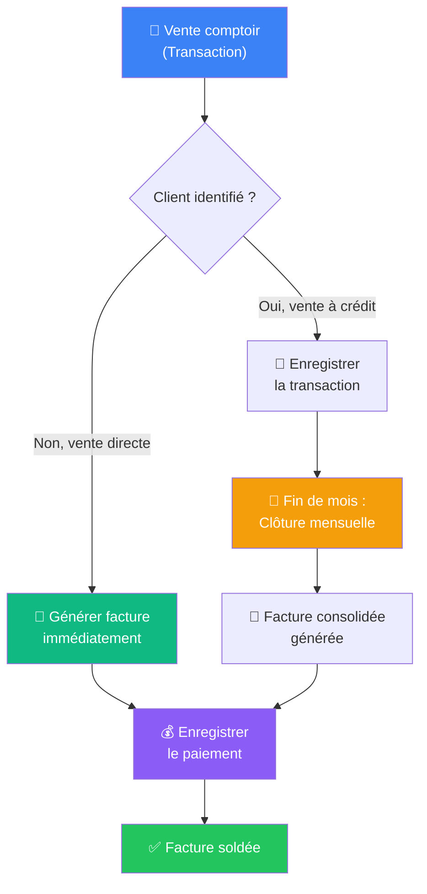

# 📘 Guide Complet — Easy Bricolage SARL CRM

> Bienvenue dans le système de gestion **Easy Bricolage SARL**.  
> Ce guide vous accompagne pas à pas dans l'utilisation de toutes les fonctionnalités du logiciel, de la première vente jusqu'au suivi des paiements.

---

## Table des matières

1. [Présentation générale](#1--présentation-générale)  
2. [Démarrage rapide](#2--démarrage-rapide)  
3. [Le Tableau de bord](#3--le-tableau-de-bord)  
4. [Flux de travail principal](#4--flux-de-travail-principal-le-cycle-complet-dune-vente)  
5. [Transactions (Ventes comptoir)](#5--transactions-ventes-comptoir)  
6. [Clôture mensuelle (Facturation groupée)](#6--clôture-mensuelle-facturation-groupée)  
7. [Factures](#7--factures)  
8. [Enregistrer un paiement](#8--enregistrer-un-paiement)  
9. [Stock et Inventaire](#9--stock-et-inventaire)  
10. [Bons de commande fournisseur](#10--bons-de-commande-fournisseur)  
11. [Clients](#11--clients)  
12. [Scénario de démonstration complet](#12--scénario-de-démonstration-complet)  
13. [Glossaire](#13--glossaire)

---

## 1 — Présentation générale

**Easy Bricolage SARL** est un ERP simplifié conçu pour la distribution d'outillage (B2B et B2C). Il gère :

| Fonction | Description |
|----------|-------------|
| 🛒 **Ventes comptoir** | Enregistrer les ventes quotidiennes au comptoir |
| 📄 **Facturation** | Générer des factures individuelles ou consolidées en fin de mois |
| 💰 **Paiements** | Suivre les paiements par espèces, chèque, virement ou transfert de dette |
| 📦 **Stock** | Surveiller les niveaux de stock et créer des bons de commande fournisseur |
| 👥 **Clients** | Gérer les fiches clients et suivre leurs soldes impayés |

### La barre latérale (Menu)

La barre latérale à gauche donne accès à toutes les sections :

| Icône | Menu | Ce qu'il fait |
|-------|------|---------------|
| 📊 | **Tableau de bord** | Vue d'ensemble avec statistiques et alertes |
| 🛒 | **Transactions** | Liste de toutes les ventes comptoir (facturées ou en attente) |
| 📄 | **Factures** | Toutes les factures générées, avec filtres et pagination |
| 📦 | **Stock** | Inventaire complet, alertes de stock bas, historique mouvements |
| 👥 | **Clients** | Liste des clients avec solde impayé et historique |
| 📅 | **Clôture mensuelle** | Regrouper les ventes en attente en facture consolidée |
| 💳 | **Paiements** | *(à venir)* |

> 💡 Un **badge rouge** apparaît sur les menus *Transactions* et *Clôture mensuelle* pour indiquer le nombre de transactions en attente de facturation.

---

## 2 — Démarrage rapide

### Lancer l'application

```bash
cd crm-project
npm run dev
```

Ouvrez votre navigateur à l'adresse : **http://localhost:3000**

L'application redirige automatiquement vers le **Tableau de bord**.

### Données de départ

Votre base de données contient déjà :

**Clients :**
| Nom | Type |
|-----|------|
| Client Divers | Particulier (ventes anonymes) |
| Chantier Atlas SARL | Entreprise |
| Electro Maghreb | Entreprise |
| M. Karim Benjelloun | Particulier |
| Bati-Pro Maroc | Entreprise |

**Fournisseur :** Bosch Maroc

**Produits :** 20 outils Bosch (perceuses, meuleuses, aspirateurs, etc.) avec leurs références SKU.

---

## 3 — Le Tableau de bord

Le tableau de bord présente un résumé en temps réel de votre activité :

### Cartes statistiques (en haut)
| Carte | Signification |
|-------|---------------|
| **Ventes totales ce mois** | Total des factures payées du mois en cours |
| **Factures impayées** | Montant total dû par tous les clients |
| **Marge brute ce mois** | Profit = Ventes − Coût d'achat |
| **Alertes stock bas** | Nombre de produits en dessous du seuil minimum (cliquer pour aller au stock) |
| **Ventes comptoir en attente** | Nombre de transactions pas encore facturées |

### Graphiques
- **Âge des créances** — Montre la répartition des impayés par ancienneté (0-30 jours / 31-60 / 60+)
- **Meilleurs clients** — Top 5 clients par chiffre d'affaires

### Factures récentes
Tableau des 8 dernières factures avec un bouton **« Enregistrer un paiement »** pour les factures impayées.

### Alertes de stock bas
Cliquez sur un produit en stock bas pour **créer directement un bon de commande fournisseur**.

---

## 4 — Flux de travail principal : le cycle complet d'une vente

Voici le workflow métier complet, de la vente à l'encaissement :



### En résumé :

1. **Vente au comptoir** → Créer une **Transaction** (page Transactions → Nouvelle transaction)
2. **2 options :**
   - **Vente directe :** Cliquer « Générer une facture » → la facture est créée immédiatement
   - **Vente à crédit :** Cliquer « Enregistrer la transaction » → elle reste « En attente »
3. **En fin de mois :** Aller dans **Clôture mensuelle** → Sélectionner les transactions en attente → Générer une facture consolidée
4. **Encaissement :** Ouvrir la facture → Enregistrer un **Paiement** (espèces, chèque, virement)
5. **Terminé !** La facture passe au statut « Payé »

---

## 5 — Transactions (Ventes comptoir)

### Accès
Cliquez sur **Transactions** dans la barre latérale.

### Vue liste
Vous voyez toutes les ventes, regroupées par date, avec :
- Un résumé : **Valeur en attente** et **Nombre en attente**
- Des onglets de filtre : **Toutes** / **En attente** / **Facturées**
- Des cases à cocher pour sélectionner des transactions

> 💡 Si vous cochez des transactions, une barre d'action flottante apparaît en bas de l'écran pour les **envoyer en clôture mensuelle**.

### Créer une nouvelle transaction

1. Cliquez le bouton **« + Nouvelle transaction »** (en haut à droite)
2. **Sélectionner le client :**
   - Cliquez sur le champ « Rechercher un client... »
   - La liste déroulante s'ouvre automatiquement
   - Tapez le nom pour filtrer (ex : « Bati »)
   - Cliquez sur le client souhaité
   - ⚠ Si le client a un solde impayé, un avertissement jaune s'affiche
3. **Ajouter des produits :**
   - Cliquez sur « Rechercher par nom ou SKU... » dans la ligne produit
   - Tapez le nom (ex : « GWS ») ou le numéro de référence
   - Sélectionnez le produit → le prix s'auto-renseigne selon le palier tarifaire
   - Modifiez la **quantité** → le prix s'ajuste automatiquement au palier correspondant
   - Cliquez **« + Ajouter une ligne »** pour ajouter d'autres produits
   - Cliquez l'icône 🗑️ pour supprimer une ligne
4. **Vérifier le résumé** (Sous-total, TVA, Total)
5. **Choisir l'action :**

| Bouton | Résultat |
|--------|----------|
| **Enregistrer la transaction** | Sauvegarde la vente comme « En attente » (pour facturation groupée ultérieure) |
| **Générer une facture** | Crée immédiatement une facture, déduit le stock, et redirige vers la facture |

> ✅ Un message de confirmation vert (toast) apparaît en haut à droite si l'opération réussit.

---

## 6 — Clôture mensuelle (Facturation groupée)

### Accès
Cliquez sur **Clôture mensuelle** dans la barre latérale.

### À quoi ça sert ?
Quand un client achète régulièrement **à crédit** pendant le mois, les transactions sont accumulées. En **fin de mois**, on les regroupe en une seule facture consolidée.

### Comment l'utiliser

**Étape 1 — Réviser les transactions :**
- Toutes les transactions en attente sont listées dans un tableau
- Chaque ligne montre : Date, Produit, Quantité, Prix unitaire, Total
- ✅ Cochez/décochez les transactions à inclure dans la facture
- 📝 Modifiez les prix unitaires si nécessaire (le prix modifié s'affiche en bleu, l'ancien est barré)

**Étape 2 — Sélectionner le client :**
- Utilisez le champ de recherche pour trouver et sélectionner le client

**Étape 3 — Générer :**
- Vérifiez le sous-total, la TVA, et le total
- Cliquez **« Générer la facture consolidée »**
- Vous êtes redirigé vers la facture générée

---

## 7 — Factures

### Accès
Cliquez sur **Factures** dans la barre latérale.

### Vue liste
- **Recherche** par numéro de facture ou nom du client
- **Filtres** par type (Factures / Avoirs) et statut (Payée / Impayée / Partielle / Brouillon)
- **Pagination** en bas de page (10 factures par page)

### Statuts des factures

| Badge | Signification |
|-------|---------------|
| 🟢 **Payé** | Entièrement soldée |
| 🟡 **Partiel** | Partiellement payée |
| 🔴 **Impayé** | Aucun paiement reçu |
| ⚪ **Brouillon** | Créée mais pas encore émise |

### Détail d'une facture
Cliquez sur une ligne pour voir le détail complet :
- Informations du client
- Liste des produits avec quantités et prix
- Historique des paiements
- Bouton **« Enregistrer un paiement »** si la facture est encore impayée

---

## 8 — Enregistrer un paiement

Vous pouvez enregistrer un paiement depuis :
- La page de **détail d'une facture**
- Le **tableau de bord** (bouton « Payer » sur les factures récentes)

### Le formulaire de paiement

| Champ | Description |
|-------|-------------|
| **Montant** | Pré-rempli avec le solde restant (modifiable pour paiement partiel) |
| **Méthode** | Espèces / Chèque / Virement / Transfert de dette |
| **N° de chèque** | Apparaît uniquement si méthode = Chèque |
| **Déduire de** | Apparaît uniquement si méthode = Transfert de dette. Permet de faire payer par un autre client |
| **Date** | Date du paiement |
| **Notes** | Commentaire optionnel |

### Paiement par transfert de dette
C'est une fonctionnalité spéciale : un client **A** peut payer la facture d'un client **B**. Le montant est alors déduit du solde du client **A**.

> Exemple : Le chantier Atlas paie la facture de M. Benjelloun. Choisir « Déduire du solde d'un autre client » puis sélectionner « Chantier Atlas SARL ».

---

## 9 — Stock et Inventaire

### Accès
Cliquez sur **Stock** dans la barre latérale.

### Alertes de stock
En haut de la page, des cartes rouges indiquent les produits en dessous du seuil minimum. Cliquez sur une carte pour sélectionner le produit et voir son historique.

### Tableau d'inventaire
- **Recherche** par nom ou référence SKU
- Colonnes : SKU, Nom, Catégorie, Quantité en stock, Unité, Stock minimum, Statut

### Statuts de stock

| Badge | Signification |
|-------|---------------|
| 🟢 **En stock** | Quantité au-dessus du minimum |
| 🟡 **Bas** | Quantité = minimum |
| 🔴 **Critique** | Quantité en dessous du minimum |

### Panneau d'historique
Cliquez sur une ligne de produit → un panneau latéral s'ouvre à droite, montrant :
- La quantité actuelle et le minimum
- L'**historique de tous les mouvements** (entrées ↓ et sorties ↑) avec dates et références

---

## 10 — Bons de commande fournisseur

### Accès
Depuis le **Tableau de bord** → Cliquez sur un produit dans « Alertes stock bas »

### Créer un bon de commande

1. **Sélectionner le fournisseur** (recherche avec filtre)
2. **Ajouter les lignes de commande :**
   - Produit (pré-rempli si accès via tableau de bord)
   - Quantité commandée
   - Coût unitaire
3. **Remplir les informations :**
   - Référence de commande (optionnel)
   - Date de commande
   - Date de livraison prévue
   - Notes
4. **Soumettre le bon de commande**

> Quand le bon de commande est reçu, le stock est automatiquement mis à jour et les mouvements d'entrée sont enregistrés.

---

## 11 — Clients

### Accès
Cliquez sur **Clients** dans la barre latérale.

### Vue liste
- Tableau avec : Nom, Type, Total facturé, Total payé, Solde dû, Dernière activité
- Pagination (10 par page)

### Détail d'un client
Cliquez sur un client pour voir :
- Ses informations de contact
- Son **solde impayé**
- Toutes ses **factures** avec statuts
- L'historique des **paiements** reçus

---

## 12 — Scénario de démonstration complet

Suivez ce scénario pas à pas pour tester toutes les fonctionnalités :

### Étape 1 : Enregistrer une vente directe (avec facture immédiate)

1. Menu → **Transactions** → **« + Nouvelle transaction »**
2. Client : **Chantier Atlas SARL**
3. Produit 1 : Tapez « GWS 700 » → Sélectionnez → Quantité : **3**
4. Cliquez **« + Ajouter une ligne »**
5. Produit 2 : Tapez « GBH 2-24 » → Sélectionnez → Quantité : **1**
6. Vérifiez le résumé (Sous-total + TVA = Total)
7. Cliquez **« Générer une facture »**
8. ✅ Vous êtes redirigé vers la facture. Notez le numéro de facture.

### Étape 2 : Enregistrer des ventes à crédit (transactions en attente)

1. Menu → **Transactions** → **« + Nouvelle transaction »**
2. Client : **Bati-Pro Maroc**
3. Produit : « GSR 120-LI » → Quantité : **2**
4. Cliquez **« Enregistrer la transaction »** (pas « Générer une facture »)
5. ✅ Message de confirmation. La transaction est « En attente ».
6. **Répétez** avec un autre produit (ex : « GAS 35 L SFC+ », Quantité : 1)

### Étape 3 : Clôture mensuelle

1. Menu → **Clôture mensuelle**
2. Vous voyez les 2 transactions de Bati-Pro Maroc en attente
3. ✅ Vérifiez que les deux sont cochées
4. Sélectionnez le client : **Bati-Pro Maroc**
5. Cliquez **« Générer la facture consolidée »**
6. ✅ Une seule facture est générée pour les deux ventes

### Étape 4 : Payer une facture

1. Menu → **Factures** → Cliquez sur la facture de Chantier Atlas
2. Cliquez **« Enregistrer un paiement »**
3. Montant : le solde complet (pré-rempli) — ou modifiez pour un paiement partiel
4. Méthode : **Espèces**
5. Cliquez **« Enregistrer un paiement »**
6. ✅ La facture passe au statut **Payé**

### Étape 5 : Vérifier le tableau de bord

1. Menu → **Tableau de bord**
2. « Ventes totales ce mois » devrait afficher le montant de la facture payée
3. « Factures impayées » devrait montrer la facture de Bati-Pro Maroc
4. « Alertes stock bas » devrait montrer les produits dont le stock a baissé

### Étape 6 : Réapprovisionner le stock

1. Sur le tableau de bord, cliquez un produit dans « Alertes stock bas »
2. Fournisseur : **Bosch Maroc**
3. Le produit est pré-rempli. Entrez une quantité (ex : 50) et un coût unitaire
4. Cliquez **« Soumettre le bon de commande »**
5. Menu → **Stock** → Vérifiez que la quantité a été mise à jour

---

## 13 — Glossaire

| Terme | Définition |
|-------|------------|
| **Transaction** | Une vente enregistrée au comptoir, peut être « en attente » ou « facturée » |
| **Facture** | Document officiel envoyé au client avec le détail des produits et montants |
| **Facture consolidée** | Facture regroupant toutes les transactions d'un client sur une période |
| **Avoir (Credit Note)** | Document qui annule partiellement une facture (retour de marchandise) |
| **Solde dû (Balance Due)** | Montant restant à payer sur une facture |
| **Clôture mensuelle** | Processus de fin de mois pour convertir les transactions en attente en factures |
| **Palier tarifaire (Price Tier)** | Prix unitaire qui varie selon la quantité commandée |
| **Transfert de dette** | Paiement effectué par un tiers (un autre client paie pour un autre) |
| **Mouvement de stock** | Entrée (achat/retour) ou sortie (vente) de produits dans l'inventaire |
| **Bon de commande** | Document envoyé au fournisseur pour commander du stock |
| **MAD** | Dirham marocain, devise utilisée dans l'application |

---

> 📖 **Besoin d'aide ?** Ce guide couvre les fonctionnalités principales. Pour toute question technique, consultez le code source ou contactez l'équipe de développement.
